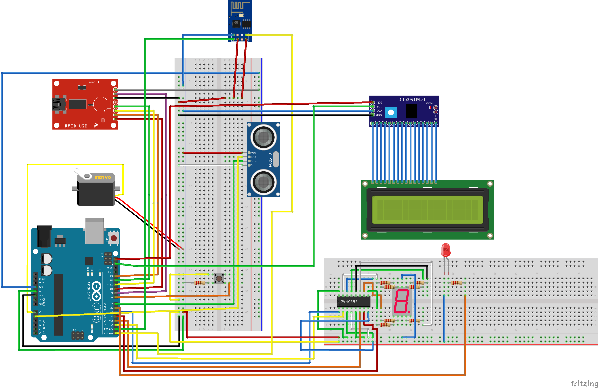

# BukaLock Arduino
Oleh RenRaiRah

## Deskripsi Sistem
Sistem arduino yang bernama BukaLock ini adalah sistem yang digunakan untuk mensimulasikan sistem pembukaan kunci maupun sebaliknya. Selain melalui aplikasi android dan unity seperti yang telah dijelaskan sebelumnya, sistem juga akan menerima aktivitas yang diterima melalui sensor ultrasonik dan RFID sebagai input. Selanjutnya, sistem akan mensimulasikan pembukaan kunci atau sebaliknya menggunakan servo standar sebagai aktuatornya.

## Panduan Instalasi
1. Rakit Arduino sesuai gambar berikut.

2. Pastikan sudah memiliki aplikasi Arduino IDE pada desktop Anda
3. Lakukan instalasi Library LiquidCrystal_I2C
4. Hubungkan Arduino yang telah Anda rakit dengan usb ke desktop Anda, lalu upload program arduino-bukalock.ino yang ada di folder arduino-bukalock

## Penggunaan Aplikasi
Dari luar ruangan, terdapat 3 cara, yaitu:
1. Gunakan aplikasi android BukaLock dengan akun yang sudah valid untuk membuka kunci menggunakan gesture. Tunggu sampai LCD menampilkan pesan keberhasilan dan kunci terbuka.
2. Gunakan aplikasi unity yang dibuka dari aplikasi BukaLock dengan akun yang sudah valid untuk membuka kunci dengan menemukan kunci yang tersembunyi. Tunggu sampai LCD menampilkan pesan keberhasilan dan kunci terbuka.
3. Letakkan kartu RFID yang sudah valid pada RFID reader yang tersedia di luar ruangan. Tunggu sampai LCD menampilkan pesan keberhasilan dan kunci terbuka.

Dari dalam ruangan, terdapat 2 cara, yaitu:
1. Letakkan tangan di depan sensor ultrasonik dan tunggu sampai kunci terbuka.
2. Tekan dan tahan tombol berwarna kuning pada sistem dan tunggu sampai kunci terbuka.

## Letak deliverables
1. File arduino-bukalock.ino yang memuat seluruh kode program terdapat di folder arduino-bukalock
